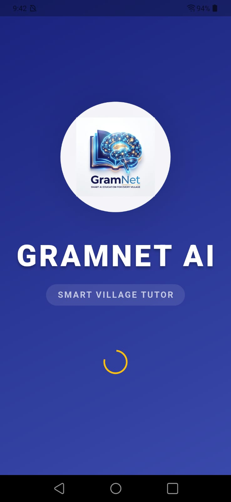
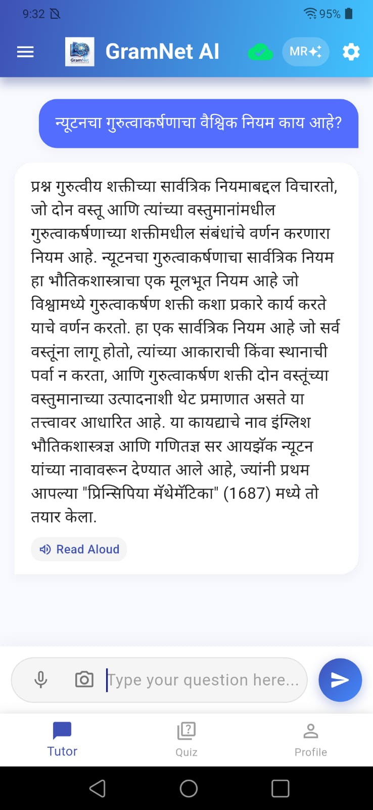
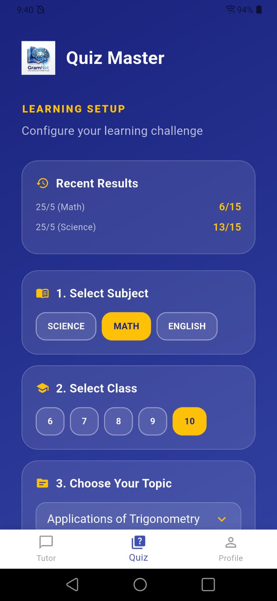
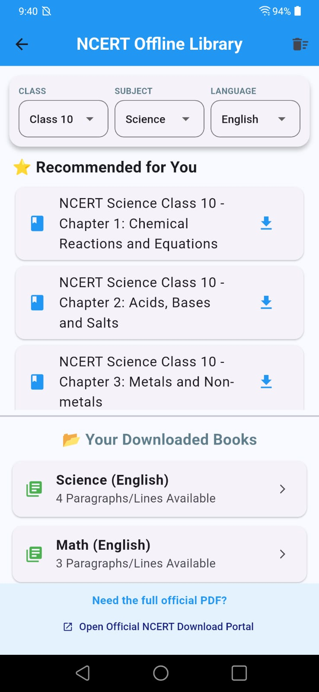
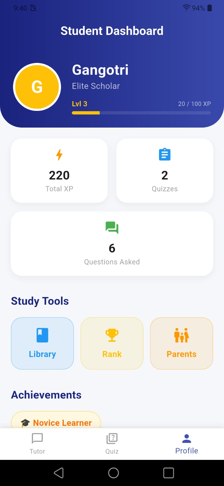
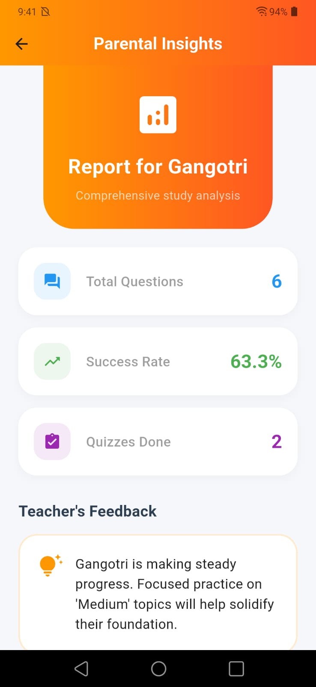
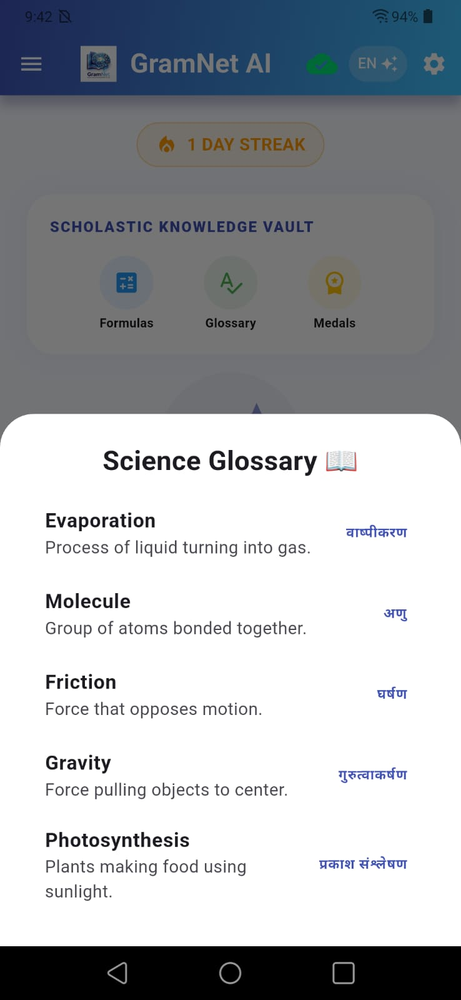
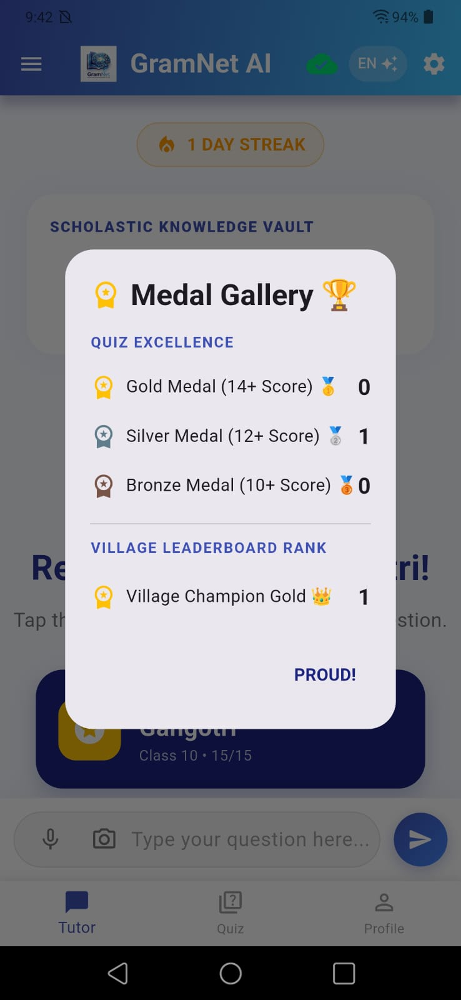
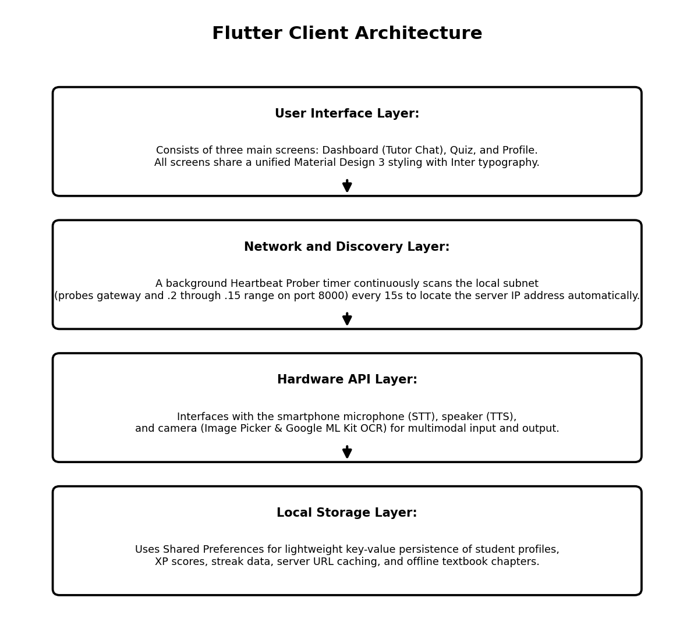
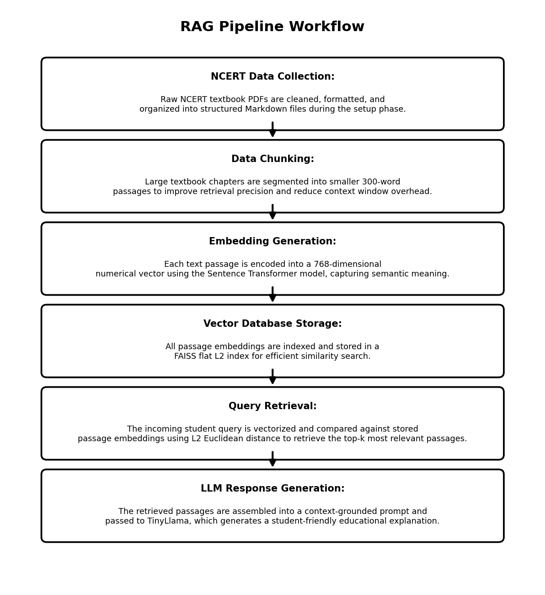

# GramNet AI Tutor

GramNet AI Tutor is an offline-first, multilingual education platform designed for students in low-connectivity and rural environments. It combines a Flutter learning application with a Python/FastAPI backend, adaptive quizzes, voice interaction, OCR, local educational content and retrieval-augmented generation.

> This repository is an academic prototype. Large language models, speech models, generated vector indexes and textbook files are intentionally excluded from Git.

## Key Features

- Offline-first Flutter learning experience
- English, Hindi and Marathi support
- 12,573 validated quiz questions
- Adaptive quiz difficulty and progress tracking
- XP, streaks, dashboards and leaderboard features
- Speech-to-text and text-to-speech interaction
- Photo-based text recognition using Google ML Kit
- Local NCERT content search and retrieval
- FastAPI backend for tutoring and synchronization
- FAISS-based semantic retrieval
- TinyLLaMA-compatible local LLM integration
- Online/offline server detection and manual server configuration

## Application Screenshots

<table>
  <tr>
    <th>Splash Screen</th>
    <th>AI Tutor</th>
    <th>Adaptive Quiz</th>
    <th>Offline Library</th>
  </tr>
  <tr>
    <td></td>
    <td></td>
    <td></td>
    <td></td>
  </tr>
  <tr>
    <th>Student Dashboard</th>
    <th>Parent Insights</th>
    <th>Science Glossary</th>
    <th>Medal Gallery</th>
  </tr>
  <tr>
    <td></td>
    <td></td>
    <td></td>
    <td></td>
  </tr>
</table>

## System Architecture

## RAG Workflow

## Technology Stack

| Layer | Technologies |
|---|---|
| Mobile application | Flutter, Dart, Material 3 |
| Backend API | Python, FastAPI, Uvicorn, Pydantic |
| Retrieval | Sentence Transformers, FAISS |
| Local language model | llama.cpp-compatible GGUF model |
| Speech | Vosk, Speech-to-Text, Flutter TTS, pyttsx3 |
| Translation | Argos Translate, Deep Translator |
| OCR | Google ML Kit Text Recognition |
| Machine learning | scikit-learn, TF-IDF, Logistic Regression |
| Data | CSV, JSON, SharedPreferences |
| Analytics | fl_chart |

## Project Structure

~~~text
gramnet-ai-tutor/
|-- ai_tutor_app/
|   |-- assets/
|   |-- lib/
|   |-- test/
|   |-- android/
|   |-- ios/
|   |-- web/
|   |-- windows/
|   `-- pubspec.yaml
|-- backend/
|   |-- api/
|   |-- core/
|   |-- data/
|   |-- models/
|   |-- quiz_engine/
|   |-- scripts/
|   |-- requirements.txt
|   |-- setup_1_download_vector_models.py
|   |-- setup_2_build_textbook_database.py
|   |-- setup_3_download_hindi_marathi_translators.py
|   |-- setup_4_train_custom_ai.py
|   `-- start_backend_server.py
|-- diagrams/
|-- .gitignore
`-- README.md
~~~

## Prerequisites

- Python 3.10 or 3.11 recommended
- Flutter SDK 3.x
- Android Studio, an emulator or a physical Android device
- Git
- Sufficient disk space for optional local AI and speech models

## Backend Setup

Run these commands from the repository root:

~~~powershell
cd backend
py -m venv .venv
.\.venv\Scripts\Activate.ps1
python -m pip install --upgrade pip
pip install -r requirements.txt
~~~

### Prepare Optional Offline AI Assets

Downloaded models, textbook PDFs and generated vector files are not stored in this repository.

To build the retrieval system:

1. Place legally obtained source documents in `backend/data/ncert_books/`.
2. Generate the chunk dataset.
3. Download the embedding model.
4. Build the FAISS index.
5. Install translation models.
6. Train the lightweight intent classifier.

~~~powershell
cd backend
python scripts/chunk_ncert.py
python setup_1_download_vector_models.py
python setup_2_build_textbook_database.py
python setup_3_download_hindi_marathi_translators.py
python setup_4_train_custom_ai.py
~~~

Local LLM and voice features additionally require compatible GGUF and Vosk model files under `backend/models/`. These large downloaded assets are excluded from version control.

### Start the Backend

~~~powershell
cd backend
python start_backend_server.py
~~~

The API runs at:

~~~text
http://127.0.0.1:8000
~~~

Interactive API documentation is available at:

~~~text
http://127.0.0.1:8000/docs
~~~

## Flutter Application Setup

Open another terminal from the repository root:

~~~powershell
cd ai_tutor_app
flutter pub get
flutter run
~~~

For an Android emulator, the application uses `http://10.0.2.2:8000` as the default backend address. For a physical device, enter the computer's local network address in the application's server configuration screen.

## Main API Endpoints

| Method | Endpoint | Purpose |
|---|---|---|
| GET | `/health` | Backend health check |
| POST | `/ask` | Submit a tutoring question |
| GET | `/topics` | List available quiz topics |
| POST | `/quiz` | Retrieve adaptive quiz questions |
| GET | `/flashcards` | Retrieve learning flashcards |
| GET | `/download_library` | Download library content |
| GET | `/download_book` | Download supported textbook content |
| POST | `/submit_score` | Submit learner progress |
| GET | `/leaderboard` | Retrieve leaderboard results |

## Testing and Validation

Validate the Python source:

~~~powershell
py -m compileall backend
~~~

Run the Flutter widget tests:

~~~powershell
cd ai_tutor_app
flutter test
~~~

The included widget test verifies that the GramNet splash screen renders successfully.

## Repository Data Policy

The following files are intentionally excluded:

- Downloaded TinyLLaMA, embedding and Vosk models
- FAISS indexes and generated pickle files
- NCERT PDFs and processed textbook extracts
- Translation caches
- Flutter build output
- Python caches, logs and local environment files

This keeps the repository lightweight and avoids redistributing third-party educational or model assets.

## Additional Diagrams

- [Flow diagram](diagrams/flow_diagram.png)
- [Sequence diagram](diagrams/sequence_diagram.png)
- [Use-case diagram](diagrams/use_case_diagram.png)

## Author

**Gangotri Kompalwar**

- GitHub: [kompalwargangotri](https://github.com/kompalwargangotri)
- LinkedIn: [Gangotri Kompalwar](https://www.linkedin.com/in/gangotri-kompalwar-4635b9359)
