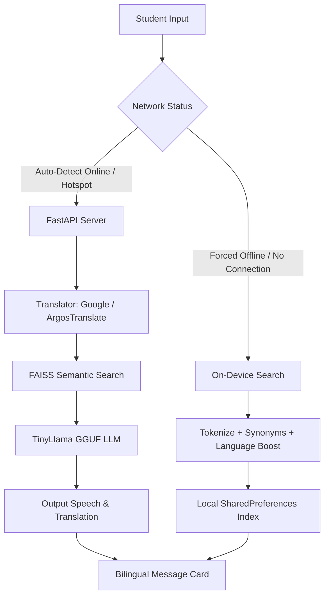

# AI Tutor Mobile Application (Flutter) & Python Backend

Welcome to the **AI Tutor App**, a premium, offline-first hybrid learning assistant designed specifically for CBSE/NCERT students in Grades 6-10. This application provides automated personalized tutoring, self-assessment, and parent analytics, with specialized architecture to run fully offline (or via local hotspots with no cellular data).

---

## 📖 Table of Contents
1. [Overview & Highlights](#overview--highlights)
2. [Online vs. Offline Feature Matrix](#online-vs-offline-feature-matrix)
3. [Core Feature Breakdown](#core-feature-breakdown)
4. [Bilingual Translation & Speech Pipeline](#bilingual-translation--speech-pipeline)
5. [System Architecture & Flows](#system-architecture--flows)
6. [Tools & Technologies Used](#tools--technologies-used)
7. [Getting Started & Installation](#getting-started--installation)
    - [Prerequisites](#prerequisites)
    - [Backend Setup & Run](#backend-setup--run)
    - [Frontend Flutter App Run](#frontend-flutter-app-run)

---

## 🌟 Overview & Highlights
AI Tutor is designed as a hybrid study companion that fits in the pocket of every student, especially in regions with intermittent, expensive, or no internet.
- **Offline-First AI Chat**: Engage in deep discussions about Science, Math, and English topics in English or Hindi (and Hinglish) even when cellular data is disconnected.
- **Forced Offline Mode Toggle**: Features a cloud button on the navigation bar that forces the application into "Forced Offline Mode," instructing the app to bypass all backend server calls and rely strictly on local SQLite/CSV databases, local SharedPreferences textbook caches, and on-device processing.
- **Micro-Inference RAG Pipeline**: In online/local network mode, the app sends queries to a lightweight Python local server running **TinyLlama** on a CPU using FAISS vector search, generating contextual textbook-anchored responses in real-time.

---

## 📶 Online vs. Offline Feature Matrix

| Feature | Online / Local Server Mode | Offline / Forced Offline Mode |
| :--- | :--- | :--- |
| **AI Tutor Chatbot** | Sends queries to Python server -> Semantics search via FAISS & Sentence-Transformers (RAG) -> Local LLM (**TinyLlama**) -> Translates output dynamically using Google Translate. | Scans locally stored textbook chunks in device memory (`SharedPreferences`). Matches terms using keyword overlap + cross-language synonyms + language alignment boosts. |
| **Bilingual Interface** | Automatically translates English textbook answers to Hindi/Marathi and displays tabbed Bilingual Cards. | Leverages a preloaded `_hybridGlossary` (English, Hindi, and Romaji) to display terms in side-by-side tabs and vocabulary chips. |
| **Speech Input (STT)** | Uses high-fidelity online speech processing. | Falls back to offline **Vosk Speech Recognition Models** (English & Hindi) loaded in the backend or on-device fallback. |
| **Speech Output (TTS)** | Implements natural neural-sounding voices via `edge-tts` (PrabhatNeural & MadhurNeural). | Automatically drops back to standard offline `pyttsx3` voices (backend) or native `flutter_tts` client-side output. |
| **Adaptive MCQ Quizzes** | Pulls from curated CSV quiz banks or triggers local LLM fallback generation on the Python server for specific classes/topics. | Loads and filters questions directly from local Flutter CSV asset (`assets/quiz_database.csv`). |
| **Quiz Leaderboard** | Submits scores directly to server (`leaderboard.csv`) and displays live top-10 global scores. | Queues completed quiz scores locally inside `SharedPreferences`. Automatically syncs them to the backend when connectivity is restored. |
| **NCERT Book Library** | Browses online catalogs and downloads chapters as raw text chunks onto the mobile device. | Opens cached or preloaded offline NCERT textbooks and quick guides (Science, Math, English) instantly. |
| **Parent Analytics** | Syncs progress details to parent dashboard in real-time. | Computes progress, streaks, XP distribution, and performance graphs locally utilizing `fl_chart`. |

---

## 🛠️ Core Feature Breakdown

### 💬 1. AI Chat Screen (Bilingual Tutor)
- **Natural Language Tutoring**: Responds to questions using textbook content.
- **Bilingual Message Bubble**: When a query is resolved, it displays a card containing **English** and **Hindi** translation tabs. Students can read the response in their native script or switch to English to build vocabulary.
- **Offline Toolbox**: A slide-in utility panel that opens when offline, providing immediate access to a Chemistry/Physics formula sheet, local bilingual glossary search, and study notes.
- **Interactive Manual Override Switch**: An icon in the AppBar displaying connection health (Green = connected, Red = forced offline/disconnected). Tap to override the automatic ping test and force the app to run completely local.

### 📝 2. Adaptive Quiz Screen
- **Self-Assessment**: Tests students on specific NCERT subjects (Math, Science, English) and chapters.
- **Adaptive Difficulty Controller**: Starts with "easy" questions. If a student answers 3 consecutive questions correctly, the engine automatically promotes the student to "medium" and then "hard." An incorrect answer instantly demotes the difficulty, ensuring an optimal zone of proximal development.
- **Score Queue & Sync**: Keeps offline score reports saved locally. When the connection resumes, it submits scores to the global leaderboard.

### 📚 3. NCERT Offline Library
- **Chapter Downloader**: Accesses the server's repository to download text chunks for offline study.
- **Integrated Reader**: Includes a custom-styled markdown and plain text reader optimized for small phone screens, with options to quiz immediately on the chapter.

### 📊 4. Parent Dashboard & Analytics
- **Visual Analytics**: Interactive, animated line charts and bar charts tracking weekly score growth and subject strengths.
- **Streaks & XP**: Encourages gamified learning with daily study streaks, rank badges, and category breakdown indicators.

---

## 🌐 Bilingual Translation & Speech Pipeline

The application manages dual languages (Hindi and English) dynamically to bridge the gap for students learning in a hybrid language system:
1. **Language Detection**: Queries are scanned using `langdetect` to classify the input.
2. **Translation Layer**:
   - **Online**: Uses `deep-translator` (Google Translate API) to map queries to English for textbook lookup, and back to Hindi for presentation.
   - **Offline**: Uses **ArgosTranslate** package (pre-downloaded translations models for `en` and `hi`) to run translations entirely locally on the server.
3. **Hybrid Glossary**: Uses a dictionary mapping English scientific terms (e.g., *Photosynthesis*) to Hindi script (*प्रकाश संश्लेषण*) and Romaji/Hinglish representation (*Prakash Sanshleshan*). If a student asks a hybrid query like *"Photosynthesis kya hai"*, the search engine translates, fetches the exact definition, and presents matching vocabulary chips below the bot message.

---

## 📐 System Architecture & Flows



---

## 🧰 Tools & Technologies Used

### Frontend (Flutter App)
* **flutter**: Core SDK.
* **http**: Handles backend REST requests (Timeout optimized to 35 seconds to support CPU inference).
* **speech_to_text**: Converts student voice questions to text.
* **flutter_tts**: Synthesizes response text to audio.
* **shared_preferences**: Persists cached NCERT chapters, local glossaries, and queued scores offline.
* **fl_chart**: Draws beautiful graphs for Parent Analytics.
* **google_mlkit_text_recognition**: (OCR) Allows students to snap photos of textbook pages to explain concepts.
* **url_launcher**: Opens references and online educational guides.

### Backend (Python Server)
* **FastAPI**: High-performance ASGI framework for web APIs.
* **Uvicorn**: Lightning-fast ASGI web server implementation.
* **llama-cpp-python**: Executes local quantized model inference (TinyLlama-1.1B GGUF) on raw CPU.
* **sentence-transformers**: Generates 384-dimensional textbook embeddings using `all-MiniLM-L6-v2`.
* **faiss-cpu**: Fast semantic vector indexing and retrieval.
* **argostranslate**: Completely offline open-source translator engine.
* **deep-translator**: Fetches online translation fallbacks.
* **langdetect**: Robust language classifier.
* **sympy**: Solves equations, algebra, and calculus expressions directly.
* **PyMuPDF**: Scans and parses textbook PDFs into clean text chunks during setup.
* **scikit-learn**: Classifies query intents.

---

## 🚀 Getting Started & Installation

### 📋 Prerequisites
- Flutter SDK (v3.10.0 or higher)
- Android Studio / Android SDK (for mobile APK deployment)
- Python 3.8 to 3.10 installed on your host server machine
- C++ Build Tools (required by `llama-cpp-python` compiler)

---

### 🐍 Backend Setup & Run

1. **Install Dependencies**:
   Open a terminal in the `backend/` directory and install the pinned dependencies:
   ```bash
   pip install -r requirements.txt
   ```

2. **Place LLM Model**:
   Download a quantized TinyLlama model (e.g., `tinyllama-1.1b-chat-v1.0.Q4_K_M.gguf`) and save it in the backend directory:
   `backend/models/tinyllama.gguf`

3. **Place Vosk Speech Models** (Optional, for offline server speech recognition):
   Download and extract Vosk models into:
   - `backend/models/vosk-model-small-en-in-0.4`
   - `backend/models/vosk-model-small-hi-0.22`

4. **Initialize Models & Data**:
   Execute the setup scripts in sequence to prepare the models, database, and translator files:
   ```bash
   # 1. Download and save the Sentence-Transformer embeddings locally
   python setup_1_download_vector_models.py

   # 2. Vectorize the NCERT textbooks and build the FAISS database index
   python setup_2_build_textbook_database.py

   # 3. Download and install English <-> Hindi offline translation models for Argos
   python setup_3_download_hindi_marathi_translators.py

   # 4. Train the custom classifier model for student intent mapping
   python setup_4_train_custom_ai.py
   ```

5. **Start the Backend Server**:
   Propose the server startup running on port 8000:
   ```bash
   python start_backend_server.py
   ```
   *Note: If testing on a mobile device over a local Wi-Fi hotspot, start the server binding to all network interfaces (`0.0.0.0`) so the phone can reach the laptop server:*
   ```bash
   python -m uvicorn start_backend_server:app --host 0.0.0.0 --port 8000
   ```

---

### 📱 Frontend Flutter App Run

1. **Configure Connection**:
   - Open the Flutter application.
   - Tap the **Settings Gear** in the top-right corner.
   - Update the IP address to match your laptop's current hotspot IP (e.g., `http://192.168.137.1:8000` or `http://10.0.2.2:8000` if running on the Android Emulator).

2. **Download Textbook Chunks (First time only)**:
   - Make sure you are in **Online Mode** (cloud icon in AppBar is green).
   - Go to the **Offline Library** tab.
   - Tap **Sync/Download Library** to fetch and store textbook chunks into the phone's local storage database (`SharedPreferences`).

3. **Run Application**:
   Open a terminal in the `ai_tutor_app/` directory and execute:
   ```bash
   flutter pub get
   flutter run
   ```

4. **Build APK**:
   To deploy directly to an Android mobile phone:
   ```bash
   flutter build apk --release
   ```
